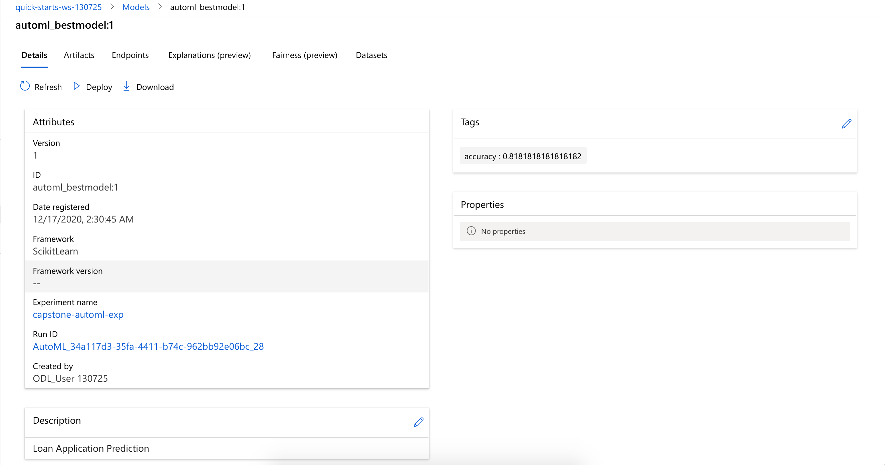
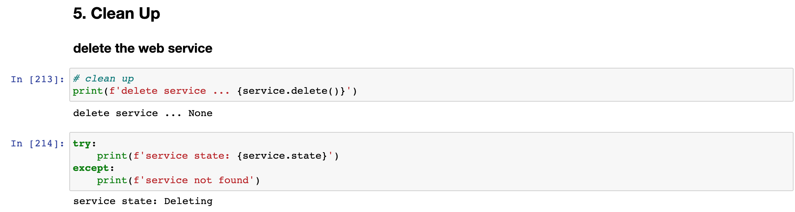

# Udacity Azure ML Nanodegree Capstone Project - Loan Application Prediction Classifier

## Overview
This Capstone project is part of the Udacity Azure ML Nanodegree.
In this project, I used a loan Application Prediction dataset from Kaggle to build a loan application prediction classifier. The classification goal is to predict if a loan application will be approved or denied given the applicant's credit history and other social economic demographic data.

I built two models, one using AutoML and one, custom model. The AutoML is equipped to train and produce the best model on its own, while the custom model leverages HyperDrive to tune training hyperparameters to deliver the best model. Between the AutoML and Hyperdrive experiment runs, a best performing model was selected for deployment. Scoring requests were then sent to the deployment endpoint to test the deployed model.

The diagram below provides an overview of the workflow:


## Project Set Up and Installation
To set up this project, you will need the following 5 items:
> * an Azure Machine Learning Workspace with Python SDK installed
>
> * the two project notebooks named `automl` and `hyperparameter_tuning`
>
> * the python script file named `train.py`
>
> * the conda environment yaml file `conda_env.yml` and scoring script `score.py`
>
To run the project,
> * upload all the 5 items to a jupyter notebook compute instance in the AML workspace and place them in the _**same folder**_
>
> * open the `automl` notebook and run each code cell _**in turn**_ from Section 1 thru 3, _**stop right before**_ Section 4 `Model Deployment`
>
> * open the `hyperparameter_tuning` and run each code cell _**in turn**_ from Section 1 thru 3, _**stop right before**_ Section 4 `Model Deployment`
>
> * compare the best model accuracy in `automl` and `hyperparameter_tuning` notebooks, run Section 4 `Model Deployment` from the notebook that has the _**best**_ performing model
>

## Dataset
### Overview
The **external** dataset is the `train_u6lujuX_CVtuZ9i.csv` of this [kaggle Loan Prediction Problem Dataset](https://www.kaggle.com/altruistdelhite04/loan-prediction-problem-dataset) which I downloaded and staged on this [Github Repo](https://raw.githubusercontent.com/atan4583/datasets/master/train.csv).

### Task
The task is to train a loan prediction classifier using the dataset. The **classification goal is to predict if a loan application will be approved or denied**.

The dataset has 613 records and 13 columns. The input variables are the columns carrying the credit history and other social economics demographics of the applicants. The output variable `Loan Status` column indicates if a loan application is approved or denied, i.e. a True (1) or False (0).

### Access
The dataset was downloaded from this [Github Repo](https://raw.githubusercontent.com/atan4583/datasets/master/train.csv) where I have staged it for direct download to the AML workspace using SDK.

Once the dataset was downloaded, SDK was again used to clean and split the data into training and validation datasets, which were then stored as Pandas dataframes in memory to facilitate quick data exploration and query, and registered as [AML TabularDatasets](https://docs.microsoft.com/en-us/python/api/azureml-core/azureml.data.tabulardataset?view=azure-ml-py) in the workspace to enable remote access by the AutoML experiment running on a remote compute cluster.

The dataset after downloaded and registered into the workspace looks like this:


Datasets in the workspace after the cleannig, splitting and registration steps:


## Automated ML
The AutoML experiment run was executed with this AutoMLConfig settings:
```python
automl_settings = {
    "experiment_timeout_minutes": 30,
    "max_concurrent_iterations": 4,
    "primary_metric" : 'accuracy',
}

automl_config = AutoMLConfig(
    task='classification',
    max_cores_per_iteration=-1,
    featurization='auto',
    iterations=30,
    enable_early_stopping=True,
    compute_target=compute_cluster,
    debug_log = 'automl_errors.log',
    training_data=train_ds,
    validation_data=valid_ds,
    label_column_name='y',
    **automl_settings)
```
A classification task with auto featurization, early stopping policy, up to 4 concurrent iterations, experiment timeout of 30 minutes and primary metric of `accuracy` was executed 30 times, using a training and a validation [TabularDataset](https://docs.microsoft.com/en-us/python/api/azureml-core/azureml.data.tabulardataset?view=azure-ml-py) and `label_column_name` set to `y` (i.e. Loan Status).

The [settings and experiment configuration](https://docs.microsoft.com/en-us/python/api/azureml-train-automl-client/azureml.train.automl.automlconfig.automlconfig?view=azure-ml-py#parameters) were chosen in consideration of such factors like:

> * classification is the best suited task to use with the dataset
> * `accuracy` as the primary metric for apple to apple comparison with the HyperDrive trained best model
> * enable early termination to terminate poorly performing runs and improves computational efficiency
> * iterations (_the total number of different algorithm and parameter combinations to test during an automated ML experiment_) of 30 to ensure the experiment can fit in the chosen experiment timeout limit of 30 minutes

The experiment ran on a remote compute cluster with the progress tracked real time using the `RunDetails` widget as shown below:


The experiment run took slightly over 21 minutes to finish:


### Resutls
The best model generated by AutoML experiment run was the `VotingEnsemble` model:


The `VotingEnsemble` model, with an accuracy of **_81.82%_**, consisted of the weighted results of 7 voting classifers as shown here:


The key parameters of the `VotingEnsemble` model:


Details and metrics of the `VotingEnsemble` model:


The AutoML experiment also generated a visual model interpretation which is useful in understanding why a model made a certain prediction as well as getting an idea of the importance of individual features for tasks.


Naturally, the `VotingEnsemble` model was saved and registered as the best model from the AutoML experiment run:




## Hyperparameter Tuning
The HyperDrive experiment run was configured with [parameter settings](https://docs.microsoft.com/en-us/python/api/azureml-train-core/azureml.train.hyperdrive.hyperdriveconfig?view=azure-ml-py#parameters) as follows:
> * define a conda environment YAML file
>   ```python
>   %%writefile conda_env.yml
>   dependencies:
>   - python=3.6.2
>   - pip:
>     - azureml-train-automl-runtime==1.18.0
>     - inference-schema
>     - azureml-interpret==1.18.0
>     - azureml-defaults==1.18.0
>   - numpy>=1.16.0,<1.19.0
>   - pandas==0.25.1
>   - scikit-learn==0.22.1
>   - py-xgboost<=0.90
>   - fbprophet==0.5
>   - holidays==0.9.11
>   - psutil>=5.2.2,<6.0.0
>   channels:
>   - anaconda
>   - conda-forge
>   ```
>
> * create a sklearn AML environment
>   ```python
>   sklearn_env = Environment.from_conda_specification(name = 'sklearn_env', file_path = './conda_env.yml')
>   ```
>
> * specify a parameter sampler
>   ```python
>   ps = RandomParameterSampling({'--C': uniform(0.1, 1.0), '--max_iter': choice(50,100,200)})
>   ```
>
> * specify an early termination policy
>   ```python
>   policy = BanditPolicy(evaluation_interval=2, slack_factor=0.1)
>   ```
>
> * specify the compute cluster, max run and number of concurrent threads
>   ```python
>   cluster = ws.compute_targets[cluster_name] # cluster_name = 'hd-ds3-v2'
>   max_run = 30
>   max_thread = 4
>   ```
>
> * create a ScriptRunConfig for use with `train.py`
>   ```python
>   src = ScriptRunConfig(source_directory='.',
>                         compute_target=cluster,
>                         script='train.py',
>                         arguments=['--C', 1.0, '--max_iter', 100],
>                         environment=sklearn_env)
>   ```
>
> * create a HyperDrive Config
>   ```python
>   hyperdrive_config = HyperDriveConfig(hyperparameter_sampling=ps,
>                                        primary_metric_name='Accuracy',
>                                        primary_metric_goal=PrimaryMetricGoal.MAXIMIZE,
>                                        max_total_runs=max_run,
>                                        max_concurrent_runs=max_thread,
>                                        policy=policy,
>                                        run_config=src)
>
>   ```
>
The python training script `train.py` was executed during the experiment run. It downloaded the dataset from this [Github Repo](https://raw.githubusercontent.com/atan4583/datasets/master/train.csv), split it into train and test sets, accepted two input parameters `C` and `max_iter` (representing Regularization Strength and Max iterations respectively) for use with [Sckit-learn LogisticRegression](https://scikit-learn.org/stable/modules/generated/sklearn.linear_model.LogisticRegression.html). These were the two hyperparameters tuned by `HyperDrive` during the experiment run.

The `max_current_runs` was set to 4 and `mex_total_runs` was set to 30 to ensure the experiment can fit in the chosen experiment timeout limit of 30 minutes.

### Benefits of the parameter sampler chosen
The [random parameter sampler](https://docs.microsoft.com/en-us/python/api/azureml-train-core/azureml.train.hyperdrive.randomparametersampling?view=azure-ml-py) for HyperDrive supports discrete and continuous hyperparameters, as well as early termination of low-performance runs. It is simple to use,  eliminates bias and increases the accuracy of the model.

### Benefits of the early stopping policy chosen
The early termination policy [BanditPolicy](https://docs.microsoft.com/en-us/python/api/azureml-train-core/azureml.train.hyperdrive.banditpolicy?view=azure-ml-py&preserve-view=true#&preserve-view=truedefinition) for HyperDrive automatically terminates poorly performing runs and improves computational efficiency. It is based on slack factor/slack amount and evaluation interval and cancels runs where the primary metric is not within the specified slack factor/slack amount compared to the best performing run.

The experiment ran on a remote compute cluster with the progress tracked real time using the `RunDetails` widget as shown below:


The experiment run took nearly 31 minutes (**notice** this was much _slower_ than the AutoML experiment run with the same 30 iterations and 4 concurrent threads on the same compute cluster type) to finish:


### Resutls
The best model generated by HyperDrive experiment run was `Run 4` with an accuracy of **_80.52%_**. The metrics and visulaization charts are as shown below:


This best mode from `Run4` was saved and registered as the best model from the HyperDrive experiment run:


## Model Deployment
The AutoML and HyperDrive experiment runs used the same dataset, number of iterations (30) and threads (4) on the same compute cluster type, yet AutoML run was more than 10 minutes faster than the HyperDrive run, as showned here:


Moreover, the best model (`VotingEnsemble`) by AutoML had an accuracy of **_81.82%_**, compared with HyperDrive's **_80.52%_** as seen here:


The AutoML model performs better than the HyperDrive model in accuracy and run efficiency. Add other bonus features of AutoML such as model interpretation, deployment artifacts (e.g. conda environment yaml file and endpoint scoring script), the clear choice for deployment is the AutoML model.

The best AutoML model (`VotingEnsemble`) was already registered at the end of the AutoML experiment run using SDK like this:
```python
   model=best_amlrun.register_model(
              model_name = 'automl_bestmodel',
              model_path = './outputs/model.pkl',
              model_framework=Model.Framework.SCIKITLEARN,
              tags={'accuracy': best_acc},
              description='Loan Application Prediction'
   )
```
and the registered model appeared on the `Models` dashboard like so:


To deploy the model, go to the `automl` notebook and execute the code cells below the markdown cell titled  `4.1 Deployment setup` like so:

> * configure a deployment environment
>   ```python
>   # Download the conda environment file produced by AutoML and create an environment
>   best_amlrun.download_file('outputs/conda_env_v_1_0_0.yml', 'conda_env.yml')
>   myenv = Environment.from_conda_specification(name = 'myenv',
>                                                file_path = 'conda_env.yml')
>   ```
>
> * configure inference config
>   ```python
>   # download the scoring file produced by AutoML
>   best_amlrun.download_file('outputs/scoring_file_v_1_0_0.py', 'score.py')
>
>   # set inference config
>   inference_config = InferenceConfig(entry_script= 'score.py',
>                                      environment=myenv)
>   ```
> * set Aci Webservice config
>   ```python
>   aci_config = AciWebservice.deploy_configuration(cpu_cores=1, memory_gb=1, auth_enabled=True)
>   ```

Next, execute the code cells below the markdown cell titled `4.2 Deploy the model as a web service` in the notebook, like so:
> * deploy the model as a web service
>   ```python
>   service = Model.deploy(workspace=ws,
>                          name='best-automl-model',
>                          models=[model],
>                          inference_config=inference_config,
>                          deployment_config=aci_config,
>                          overwrite=True)
>   ```
>
> * wait for the deployment to finish, query the web service state
>   ```python
>   service.wait_for_deployment(show_output=True)
>   print(f'\nservice state: {service.state}\n')
>   ```
> * print the scoring uri, swagger uri and the primary authentication key
>   ```python
>   print(f'scoring URI: \n{service.scoring_uri}\n')
>   print(f'swagger URI: \n{service.swagger_uri}\n')
>
>   pkey, skey = service.get_keys()
>   print(f'primary key: {pkey}')
>   ```
>

After executing the above block of code cells, the model was deployed as a web service and appeared on the Endpoints dashboard like the screenshots shown below:


To test the scoring endpoint, execute the code cells below the markdown cell titled `4.3 Testing the web service` in the notebook as shown here:
> * prepare a sample payload
>   ```python
>   # select 2 random samples from the validation dataframe xv
>   scoring_sample = xv.sample(2)
>   y_label = scoring_sample.pop('y')
>
>   # convert the sample records to a json data file
>   scoring_json = json.dumps({'data': scoring_sample.to_dict(orient='records')})
>   print(f'{scoring_json}')
>   ```


> * set request headers, post the request and check the response
>   ```python
>   # Set the content type
>   headers = {"Content-Type": "application/json"}
>
>   # set the authorization header
>   headers["Authorization"] = f"Bearer {pkey}"
>
>   # post a request to the scoring uri
>   resp = requests.post(service.scoring_uri, scoring_json, headers=headers)
>
>   # print the scoring results
>   print(resp.json())
>
>   # compare the scoring results with the corresponding y label values
>   print(f'True Values: {y_label.values}')
>   ```


> * another way to send a request to the scoring endpoint without sending the key is to call the `run` method of the web service like so:
>   ```python
>   # another way to test the scoring uri
>   print(f'Prediction: {service.run(scoring_json)}')
>   ```


Next up, optionally enable [Application Insights](https://docs.microsoft.com/en-us/azure/azure-monitor/app/app-insights-overview) by executing the code cells below the markdown cell titled `4.4 Enable Application Insights` in the  notebook, as illustrated here:
> * enable Application Insights
>   ```python
>   # update web service to enable Application Insights
>   service.update(enable_app_insights=True)
>
>   # wait for the deployment to finish, query the web service state
>   service.wait_for_deployment(show_output=True)
>   print(f'\nservice state: {service.state}\n')
>   ```


Application Insights collects useful data from the web service endpoint, such as
> * Output data
>
> * Responses
>
> * Request rates, response times, and failure rates
>
> * Dependency rates, response times, and failure rates
>
> * Exceptions
>

The data is useful for monitoring the endpoint. It also automatically detect performance anomalies, and includes powerful analytics tools to help you diagnose issues and to understand what users actually do with your app. It's designed to help you continuously improve performance and usability.

For example, the dashboard showed the **_30_** scoring requests I sent to the endpoint with an average response time of **_312.47_** ms and **_0_** failed request:


To print the logs of the web service, run the code cells below the markdown cell titled `4.5 Printing the logs of the web service` in the notebook, like so:
> * print the logs of the web service
>   ```python
>   # print the logs by calling the get_logs() function of the web service
>   print(f'webservice logs: \n{service.get_logs()}\n')
>   ```


Lastly, to run **_a demo of the active web service scoring endpoint_**, run the code cells under the markdown cell titled `4.6 Active web service endpoint Demo` in the notebook as shown here:

> * prepare a sample payload
>   ```python
>   # select 3 random samples from the validation dataframe xv
>   scoring_sample = xv.sample(3)
>   y_label = scoring_sample.pop('y')
>
>   # convert the sample records to a json data file
>   scoring_json = json.dumps({'data': scoring_sample.to_dict(orient='records')})
>   print(f'{scoring_json}')
>   ```


> * set request headers, post the request and check the response
>   ```python
>   # Set the content type
>   headers = {"Content-Type": "application/json"}
>
>   # set the authorization header
>   headers["Authorization"] = f"Bearer {pkey}"
>
>   # post a request to the scoring uri
>   resp = requests.post(service.scoring_uri, scoring_json, headers=headers)
>
>   # print the scoring results
>   print(resp.json())
>
>   # compare the scoring results with the corresponding y label values
>   print(f'True Values: {y_label.values}')
>
>   # another way to test the scoring uri
>   print(f'Prediction: {service.run(scoring_json)}')
>   ```


Finally, to delete the web service deployed, run the code cells under the markdown cell titled `5. Clean Up` in the notebook:



### Model Deployment Notes
* The deployment steps described above are for deploying the best AutoML model, to deploy the best HyperDrive model, simply execute the code cells under the markdown cell titled `4. Model Deployment`  section in the `hyperparameter_tuning` notebook.
* The best model file that was used in this project deployment can be found in the [best_model](https://github.com/atan4583/Capstone-Project-Azure-Machine-Learning-Engineer/tree/master/best_model) folder.
* The registered model file from the AutoML and HyperDrive experiment runs in this project can be found in the [registered_model](https://github.com/atan4583/Capstone-Project-Azure-Machine-Learning-Engineer/tree/master/registered_model) folder.
* This [conda environment](https://github.com/atan4583/Capstone-Project-Azure-Machine-Learning-Engineer/blob/master/conda_env.yml) file contains the deployment environment details and must be included in the model deployment.
* This [scoring script](https://github.com/atan4583/Capstone-Project-Azure-Machine-Learning-Engineer/blob/master/score.py) file contains  the functions used to initialize the deployed web service at startup and run the model using request data passed in by a client call. It must be included in the model deployment.


## Screen Recording
A screencast showing:
> * a working model
>
> * a demo of the deployed  model
>
> * a demo of a sample request sent to the endpoint and its response
>
is available here:

<a href="http://www.youtube.com/watch?feature=player_embedded&v=YlWKbA4l9bA
" target="_blank"></a>


## Future Project Improvements
A small dataset was chosen for this project with the resource and time constraints of Udacity project workspace in mind. Without the constraints, we can possibly try the following improvement ideas:
> * Increase the model training time
>
> * Apply model interpretability of AutoML on more complex and larger datasets, to gain speed and valuable insights in feature engineering, which can in turn help to improve the model accuracy further
>
> * Experiment with different hyperparameter sampling methods like [Gird sampling](https://docs.microsoft.com/en-us/python/api/azureml-train-core/azureml.train.hyperdrive.gridparametersampling?view=azure-ml-py&preserve-view=true) or [Bayesian sampling](https://docs.microsoft.com/en-us/python/api/azureml-train-core/azureml.train.hyperdrive.bayesianparametersampling?view=azure-ml-py&preserve-view=true) on the Scikit-learn LogicRegression model or other custom-coded machine learning models

## List of Required Screenshots
The screenshots referenced in this README can be found in the folder named **[assets](https://github.com/atan4583/Capstone-Project-Azure-Machine-Learning-Engineer/tree/master/assets)**. A short description (description marked with an **_asterisk_** denotes **_mandatory_** submission screenshot) and link to each of them is listed here:
* Common
  - [Project Workflow Overview](https://github.com/atan4583/Capstone-Project-Azure-Machine-Learning-Engineer/blob/master/assets/MLworkflow.png)
  - [Compute Instance](https://github.com/atan4583/Capstone-Project-Azure-Machine-Learning-Engineer/blob/master/assets/ComputeInstance.png)
  - [Compute Clusters](https://github.com/atan4583/Capstone-Project-Azure-Machine-Learning-Engineer/blob/master/assets/ComputeClusters.png)
  - [Registered Datasets](https://github.com/atan4583/Capstone-Project-Azure-Machine-Learning-Engineer/blob/master/assets/All-DS.png)
  - [Registered Loan Prediction Dataset](https://github.com/atan4583/Capstone-Project-Azure-Machine-Learning-Engineer/blob/master/assets/LoanPred-DS.png)
  - [Registered Loan Prediction Training Dataset](https://github.com/atan4583/Capstone-Project-Azure-Machine-Learning-Engineer/blob/master/assets/LoanPred-TrainDS.png)
  - [Registered Loan Prediction Training Dataset](https://github.com/atan4583/Capstone-Project-Azure-Machine-Learning-Engineer/blob/master/assets/LoanPred-ValidateDS.png)

* AutoML
  - [AutoML Experiment Run completed](https://github.com/atan4583/Capstone-Project-Azure-Machine-Learning-Engineer/blob/master/assets/AutoMLexp-Done.png)
  - [AutoML RunDetails widget *](https://github.com/atan4583/Capstone-Project-Azure-Machine-Learning-Engineer/blob/master/assets/AutoMLexp-RunDetails.png)
  - [AutoML Best Model *](https://github.com/atan4583/Capstone-Project-Azure-Machine-Learning-Engineer/blob/master/assets/AutoMLexp-TopModel.png)
  - [AutoML Best Model with its run id *](https://github.com/atan4583/Capstone-Project-Azure-Machine-Learning-Engineer/blob/master/assets/AutoMLexp-BestRunID.png)
  - [AutoML Best Model Details](https://github.com/atan4583/Capstone-Project-Azure-Machine-Learning-Engineer/blob/master/assets/AutoMLexp-VEDtls.png)
  - [AutoML Best Model Training Algorithms](https://github.com/atan4583/Capstone-Project-Azure-Machine-Learning-Engineer/blob/master/assets/AutoMLexp-VEAlgoWgt.png)
  - [AutoML Best Model Key Parameters](https://github.com/atan4583/Capstone-Project-Azure-Machine-Learning-Engineer/blob/master/assets/AutoMLexp-VEkeyParam.png)
  - [AutoML Best Model Accuracy and Run Id](https://github.com/atan4583/Capstone-Project-Azure-Machine-Learning-Engineer/blob/master/assets/AutoMLexp-VEMetrics-2.png)
  - [AutoML Best Model Estimator Details ](https://github.com/atan4583/Capstone-Project-Azure-Machine-Learning-Engineer/blob/master/assets/AutoMLexp-VEMetrics-3.png)
  - [AutoML Best Model Metrics](https://github.com/atan4583/Capstone-Project-Azure-Machine-Learning-Engineer/blob/master/assets/AutoMLexp-VEMetrics-4.png)
  - [AutoML Explainer: Dataset Exploration](https://github.com/atan4583/Capstone-Project-Azure-Machine-Learning-Engineer/blob/master/assets/AutoMLexp-Explain-1.png)
  - [AutoML Explainer: Global Importance](https://github.com/atan4583/Capstone-Project-Azure-Machine-Learning-Engineer/blob/master/assets/AutoMLexp-Explain-2.png)
  - [AutoML Explainer: Explanation Exploration](https://github.com/atan4583/Capstone-Project-Azure-Machine-Learning-Engineer/blob/master/assets/AutoMLexp-Explain-3.png)
  - [AutoML Explainer: Summary Importance](https://github.com/atan4583/Capstone-Project-Azure-Machine-Learning-Engineer/blob/master/assets/AutoMLexp-Explain-4.png)
  - [Saving and Registering AutoML Best Model](https://github.com/atan4583/Capstone-Project-Azure-Machine-Learning-Engineer/blob/master/assets/AutoMLexp-BestModelDnldReg.png)
  - [AutoML Registered Best Model](https://github.com/atan4583/Capstone-Project-Azure-Machine-Learning-Engineer/blob/master/assets/AutoMLexp-BestModelReg.png)
  - [AutoML Registered Best Model Details](https://github.com/atan4583/Capstone-Project-Azure-Machine-Learning-Engineer/blob/master/assets/AutoMLexp-BestModelRegDtl.png)

* HyperDrive
  - [HyperDrive Experiment Run Completion](https://github.com/atan4583/Capstone-Project-Azure-Machine-Learning-Engineer/blob/master/assets/HDexp-Done.png)
  - [HyperDrive RunDetails Widget *](https://github.com/atan4583/Capstone-Project-Azure-Machine-Learning-Engineer/blob/master/assets/HDexp-RunDetails.png)
  - [HyperDrive RunDetails Widget Metrics Visual *](https://github.com/atan4583/Capstone-Project-Azure-Machine-Learning-Engineer/blob/master/assets/HDexp-RunDetailsVis.png)
  - [Visualization of HyperDrive Training Progress and Performance of Hyperparameter Runs * ](https://github.com/atan4583/Capstone-Project-Azure-Machine-Learning-Engineer/blob/master/assets/HDexp-RunProgressVis.png)
  - [HyperDrive Best Model *](https://github.com/atan4583/Capstone-Project-Azure-Machine-Learning-Engineer/blob/master/assets/HDexp-topModel.png)
  - [HyperDrive Best Model Hyperparamters and Run Id * ](https://github.com/atan4583/Capstone-Project-Azure-Machine-Learning-Engineer/blob/master/assets/HDexp-topModelMetrics-RunId.png)
  - [HyperDrive Best Model Run Id and Tuned Hyperparamters *](https://github.com/atan4583/Capstone-Project-Azure-Machine-Learning-Engineer/blob/master/assets/HDexp-topModelDtls.png)
  - [HyperDirve Best Model Metrics](https://github.com/atan4583/Capstone-Project-Azure-Machine-Learning-Engineer/blob/master/assets/HDexp-topModelMetricsVis.png)
  - [Saving and Registering HyperDrive Best Model](https://github.com/atan4583/Capstone-Project-Azure-Machine-Learning-Engineer/blob/master/assets/HDexp-BestModelDnldReg.png)
  - [HyperDrive Registered Best Model](https://github.com/atan4583/Capstone-Project-Azure-Machine-Learning-Engineer/blob/master/assets/HDexp-BestModelReg.png)
  - [HyperDrive Registered Best Model Details](https://github.com/atan4583/Capstone-Project-Azure-Machine-Learning-Engineer/blob/master/assets/HDexp-BestModelRegDtl.png)

* Deployment
  - [AutoML and HyperDrive Experiment Run Duration Comparison ](https://github.com/atan4583/Capstone-Project-Azure-Machine-Learning-Engineer/blob/master/assets/ExpRunDuration.png)
  - [Best Model Pick for Deployment ](https://github.com/atan4583/Capstone-Project-Azure-Machine-Learning-Engineer/blob/master/assets/ModelDeployChoice.png)
  - [Best Model Endpoint](https://github.com/atan4583/Capstone-Project-Azure-Machine-Learning-Engineer/blob/master/assets/ModelDeployEndPoint.png)
  - [Active Best Model Endpoint *](https://github.com/atan4583/Capstone-Project-Azure-Machine-Learning-Engineer/blob/master/assets/ModelDeployEndPointDtls.png)
  - [Best Model EndPoint Consume](https://github.com/atan4583/Capstone-Project-Azure-Machine-Learning-Engineer/blob/master/assets/ModelDeployEndPointKeys.png)
  - [Best Model Deployment logs](https://github.com/atan4583/Capstone-Project-Azure-Machine-Learning-Engineer/blob/master/assets/ModelDeployEndPointLogs.png)
  - [Enable Application Insights](https://github.com/atan4583/Capstone-Project-Azure-Machine-Learning-Engineer/blob/master/assets/WSUpdt-AppInsightEnable.png)
  - [Application Insights URL](https://github.com/atan4583/Capstone-Project-Azure-Machine-Learning-Engineer/blob/master/assets/ModelDeployUpdtAppInsight.png)
  - [Application Insights Dashboard](https://github.com/atan4583/Capstone-Project-Azure-Machine-Learning-Engineer/blob/master/assets/WSUpdt-AppInsightPage.png)
  - [Monitoring Scoring Endpoint with Application Insights](https://github.com/atan4583/Capstone-Project-Azure-Machine-Learning-Engineer/blob/master/assets/WSUpdt-AppInsightRqst.png)
  - [Printing Logs of the Web Service](https://github.com/atan4583/Capstone-Project-Azure-Machine-Learning-Engineer/blob/master/assets/PrintWSLogs.png)
  - [Prepare Data Payload for Testing Scoring Endpoint](https://github.com/atan4583/Capstone-Project-Azure-Machine-Learning-Engineer/blob/master/assets/WSTest-payload.png)
  - [Testing Scoring Endpoint](https://github.com/atan4583/Capstone-Project-Azure-Machine-Learning-Engineer/blob/master/assets/WSTest-rqtrsp.png)
  - [Alternate way for Testing Scoring Endpoint](https://github.com/atan4583/Capstone-Project-Azure-Machine-Learning-Engineer/blob/master/assets/WSTest-sendpayload.png)
  - [Inference Demo: Preparing Data Payload](https://github.com/atan4583/Capstone-Project-Azure-Machine-Learning-Engineer/blob/master/assets/ScoringEndptDemo-payload.png)
  - [Inference Demo: Posting Request](https://github.com/atan4583/Capstone-Project-Azure-Machine-Learning-Engineer/blob/master/assets/ScoringEndptDemo-PostRqst.png)
  - [Delete Web Service](https://github.com/atan4583/Capstone-Project-Azure-Machine-Learning-Engineer/blob/master/assets/DeleteWS.png)

## Citations

#### Project Starter Code
[Udacity Github Repo](https://github.com/udacity/nd00333-capstone/tree/master/starter_file)

#### MLEMAND ND Using Azure Machine Learning
[Lesson 6.3 - Exercise: Hyperparameter Tuning with HyperDrive](https://youtu.be/SfFqgN1oebM)

[Lesson 6.8 - Exercise: AutoML and the SDK](https://youtu.be/KM8wYoxYeX0)

#### MLEMAND ND Machine Learning Operations
[Lesson 2.5 - Exercise: Enable Security and Authentication](https://youtu.be/rsECJolX2Ns)

[Lesson 2.10 - Exercise: Deploy an Azure Machine learning Model](https://youtu.be/_RKfF1D6W24)

[Lesson 2.15 - Exercise: Enable Application Insights](https://youtu.be/EXGfNMMTuMY)

#### Azure Machine Learning Documentation and Example Code Snippets
[List all ComputeTarget objects within the workspace](https://docs.microsoft.com/en-us/python/api/azureml-core/azureml.core.computetarget?view=azure-ml-py#list-workspace-)

[Create a dataset from pandas dataframe](https://docs.microsoft.com/en-us/azure/machine-learning/how-to-create-register-datasets#create-a-dataset-from-pandas-dataframe)

[Model Registration and Deployment](https://github.com/Azure/MachineLearningNotebooks/blob/master/how-to-use-azureml/deployment/deploy-to-cloud/model-register-and-deploy.ipynb)

[Using environments](https://github.com/Azure/MachineLearningNotebooks/blob/master/how-to-use-azureml/training/using-environments/using-environments.ipynb)

[AciWebservice Class](https://docs.microsoft.com/en-us/python/api/azureml-core/azureml.core.webservice.aciwebservice?view=azure-ml-py#deploy-configuration-cpu-cores-none--memory-gb-none--tags-none--properties-none--description-none--location-none--auth-enabled-none--ssl-enabled-none--enable-app-insights-none--ssl-cert-pem-file-none--ssl-key-pem-file-none--ssl-cname-none--dns-name-label-none--primary-key-none--secondary-key-none--collect-model-data-none--cmk-vault-base-url-none--cmk-key-name-none--cmk-key-version-none--vnet-name-none--subnet-name-none-)

[What is Application Insights?](https://docs.microsoft.com/en-us/azure/azure-monitor/app/app-insights-overview)

#### External Dataset
[Kaggle Loan Prediction Dataset](https://www.kaggle.com/altruistdelhite04/loan-prediction-problem-dataset?select=train_u6lujuX_CVtuZ9i.csv)
