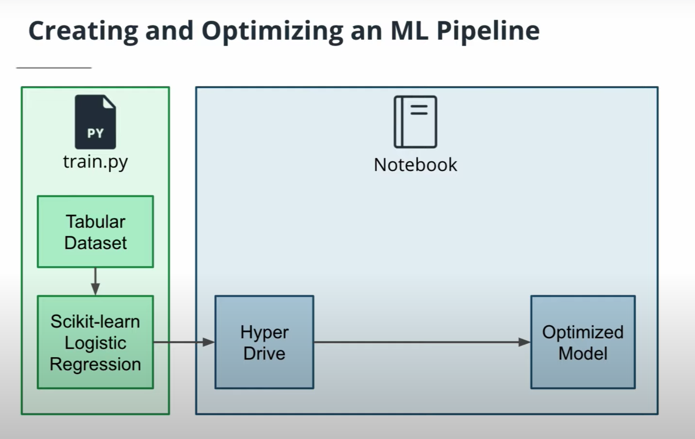
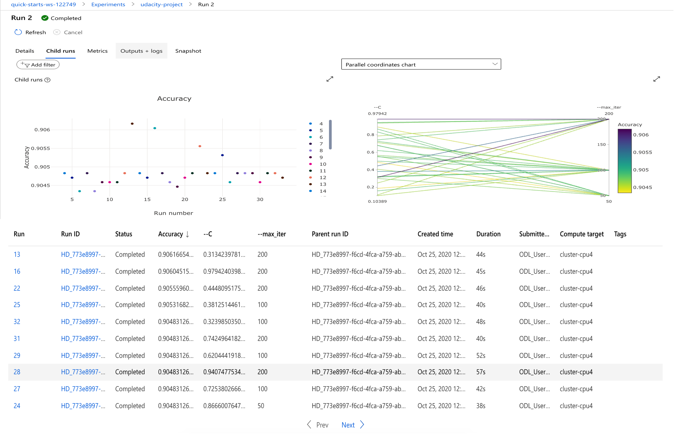
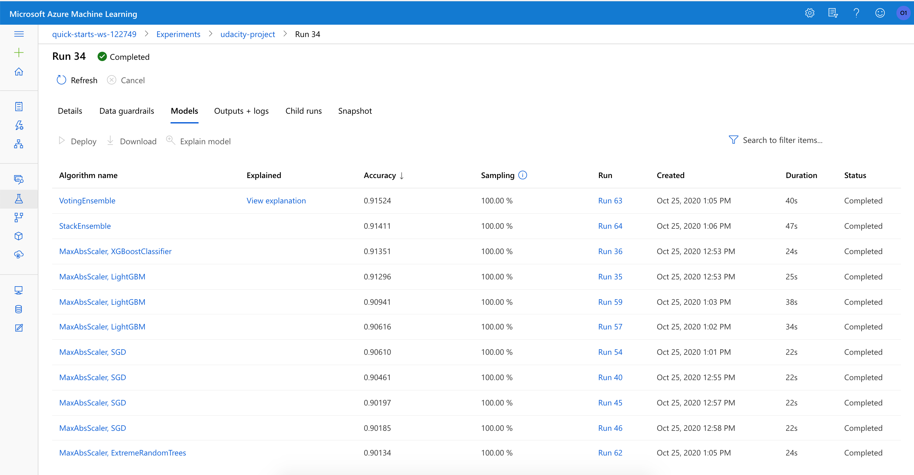
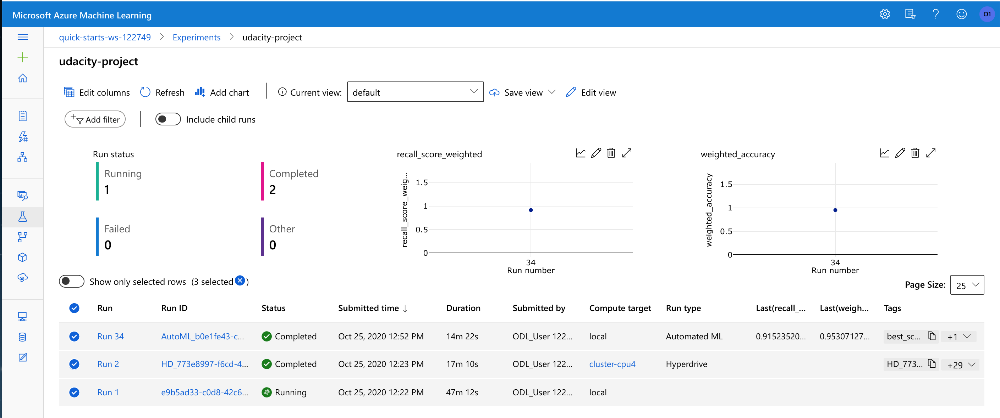
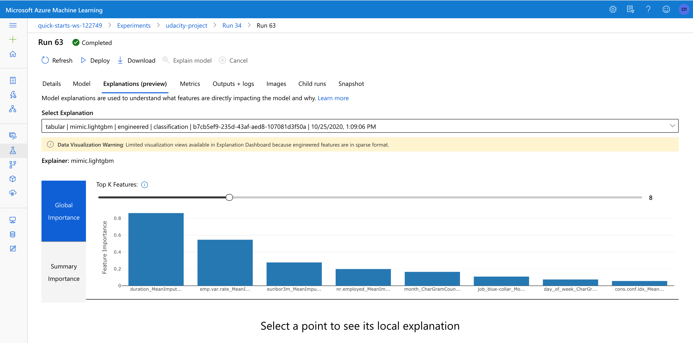
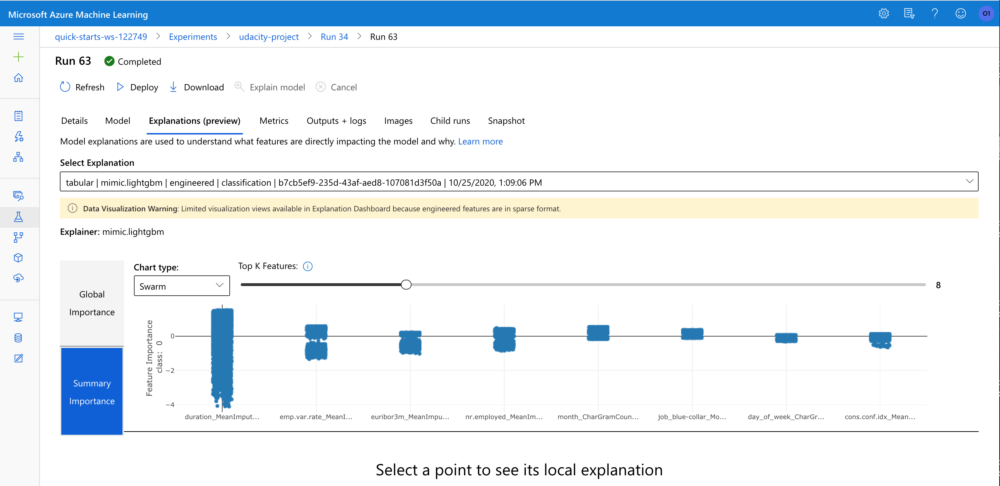
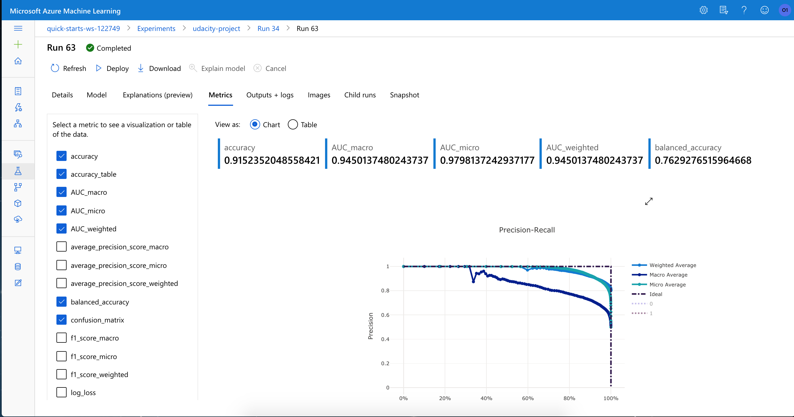
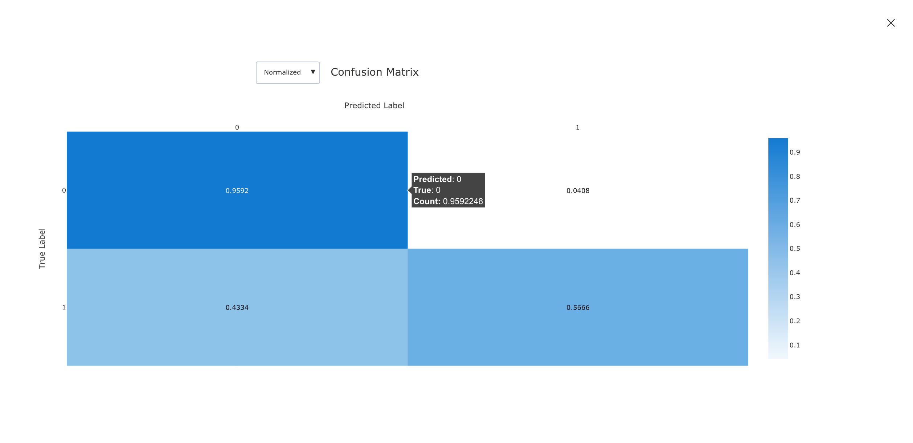

# Optimizing an Azure ML Pipeline

## Overview
This project is part of the Udacity Azure ML Nanodegree.
In this project, we build and optimize an Azure ML pipeline using the Python SDK and a provided Scikit-learn model.
This model is then compared to an Azure AutoML run.

## Summary
The Bank Marketing dataset from [UCI ML Repository](https://archive.ics.uci.edu/ml/datasets/Bank+Marketing), contains demographic data of bank clients and their responses (Yes or No) to direct phone marketing campaigns of direct term deposit products. The classification goal is to predict if the client will subscribe a term deposit. Therefore the input variables are columns representing client demographics and the output variable is the `y` column representing has the client subscribed to a term deposit (binary Yes or No).

The best performing model is an ensemble model `VotingEnsemble` produced by the AutomML run. It has an accuracy rate of **91.52%** vs **90.60%** by the `HyperDrive assisted Scikit-learn LogicRegression` model.

## Scikit-learn Pipeline
#### Pipeline Architecture
The pipeline architecture consists of a python training script (`train.py`), a tabular dataset downloaded from UCI ML Repository, a Scikit-learn Logistic Regression Algorithm connected to the `Azure HyperDrive`, a hyperparameter tuning engine, to produce a HyperDrive classifier. The training run was orchestrated by a Jupyter Notebook hosted on a compute instance. The diagram below (**Image credit: Udacity MLEMA Nanodegree**) presents a logical view of the architecture.



#### Dataset
The dataset was programmatically (using the `train.py` script) downloaded from the web, split into train and test sets using [Sckit-learn train_test_split](https://scikit-learn.org/stable/modules/generated/sklearn.model_selection.train_test_split.html?highlight=train_test_split#sklearn.model_selection.train_test_split) utility

#### HyperDrive Tuning
This entails the following:
> * specify a parameter sampler
>   ```python
>   ps = RandomParameterSampling({'--C': uniform(0.1, 1.0), '--max_iter': choice(50,100,200)})
>   ```
>
> * specify an early termination policy
>   ```python
>   policy = BanditPolicy(evaluation_interval=2, slack_factor=0.1)
>   ```
>
> * create a SKLearn estimator
>   ```python
>   est = SKLearn(source_directory='.',
>                 compute_target=compute_cluster,
>                 entry_script='train.py',
>                 script_params={'--C': 1.0, '--max_iter': 100})
>   ```
>
> * create a HyperDrive Config
>   ```python
>   hyperdrive_config = HyperDriveConfig(hyperparameter_sampling=ps,
>                                        primary_metric_name='Accuracy',
>                                        primary_metric_goal=PrimaryMetricGoal.MAXIMIZE,
>                                        max_total_runs=30,
>                                        max_concurrent_runs=4,
>                                        policy=policy,
>                                        estimator=est)
>   ```
>
Notice the python training script was executed during the pipeline run. It downloaded the dataset from the web, split it into train and test sets, accepted two input parameters `C` and `max_iter` (representing Regularization Strength and Max iterations respectively) for use with [Sckit-learn LogisticRegression](https://scikit-learn.org/stable/modules/generated/sklearn.linear_model.LogisticRegression.html)

#### Benefits of the parameter sampler chosen
The [random parameter sampler](https://docs.microsoft.com/en-us/python/api/azureml-train-core/azureml.train.hyperdrive.randomparametersampling?view=azure-ml-py) for HyperDrive supports discrete and continuous hyperparameters, as well as early termination of low-performance runs. It is simple to use,  eliminates bias and increases the accuracy of the model.

#### Benefits of the early stopping policy chosen
The early termination policy [BanditPolicy](https://docs.microsoft.com/en-us/python/api/azureml-train-core/azureml.train.hyperdrive.banditpolicy?view=azure-ml-py&preserve-view=true#&preserve-view=truedefinition) for HyperDrive automatically terminates poorly performing runs and improves computational efficiency. It is based on slack factor/slack amount and evaluation interval and cancels runs where the primary metric is not within the specified slack factor/slack amount compared to the best performing run.

## AutoML
The AutoML run was executed with this AutoMLConfig settings:
```python
automl_config = AutoMLConfig(
    experiment_timeout_minutes=30,
    task='classification',
    primary_metric='accuracy',
    max_concurrent_iterations=4,
    max_cores_per_iteration=-1,
    featurization='auto',
    iterations=30,
    enable_early_stopping=True,
    debug_log = 'automl_errors.log',
    training_data=x,
    label_column_name='y',
    n_cross_validations=2)
```

The best model generated from the run was a `VotingEnsemble` model, which consisted of 9 voting classifers and weights as follows:
```
prefittedsoftvotingclassifier
{'estimators': ['1', '0', '24', '22', '19', '5', '11', '15', '4'],
 'weights': [0.26666666666666666,
             0.2,
             0.06666666666666667,
             0.06666666666666667,
             0.06666666666666667,
             0.06666666666666667,
             0.06666666666666667,
             0.13333333333333333,
             0.06666666666666667]}

where estimator
  '1' - xgboostclassifier
  '0' - lightgbmclassifier
 '24' - lightgbmclassifier
 '22' - lightgbmclassifier
 '19' - sgdclassifierwrapper
  '5' - sgdclassifierwrapper
 '11' - sgdclassifierwrapper
 '15' - sgdclassifierwrapper
  '4' - sgdclassifierwrapper
```

AutoML combined the predictions of the 9 voting classifiers to arrive at the best accuracy rate of **91.52%**. The key parameters (refer to Notebook cells `In [29]` and `In [36]`) generated by AutoML were:
```
l1_ratio=0.3877551020408163,
learning_rate='invscaling',
loss='log',
max_iter=1000,
n_jobs=-1,
penalty='none',
power_t=0,
random_state=None,
tol=0.01
```

Detailed information on the `VotingEnsemble` model was collected during the run and stored in this [VotingEnsemble_info.txt](https://github.com/atan4583/Optimizing-an-ML-Pipeline-in-Azure/blob/master/VotingEnsemble_Info.txt) file. It lists the hyperparameters of the 9 voting classifiers, for example, that of `XGBoostClassifier` looks like this:

```
1 - xgboostclassifier
{'base_score': 0.5,
 'booster': 'gbtree',
 'colsample_bylevel': 1,
 'colsample_bynode': 1,
 'colsample_bytree': 1,
 'gamma': 0,
 'learning_rate': 0.1,
 'max_delta_step': 0,
 'max_depth': 3,
 'min_child_weight': 1,
 'missing': nan,
 'n_estimators': 100,
 'n_jobs': -1,
 'nthread': None,
 'objective': 'binary:logistic',
 'random_state': 0,
 'reg_alpha': 0,
 'reg_lambda': 1,
 'scale_pos_weight': 1,
 'seed': None,
 'silent': None,
 'subsample': 1,
 'tree_method': 'auto',
 'verbose': -10,
 'verbosity': 0}
```

## Pipeline comparison
The `HyperDrive assisted Scikit-learn LogicRegression` model produced a top accuracy of **90.60%** as shown below:


By contrast, the AutoML generated `VotingEnsemble` model yielded a top accuracy of **91.52%** like so:


Both runs used the same dataset and iterations (30 times). AutoML run was slighty faster than HyperDrive run, as showned in this diagram:


The difference in accuracy is small. However, architectuarally, there is a difference between the two. To use HyperDrive, a custom-coded machine learning model is required. Whereas to utilize AutoML, one only needs to select some paramters for AutoML config and AutoML does the rest. Additionally, AutoML offers model interpretation which is useful in understanding why a model made a certain prediction as well as getting an idea of the importance of individual features for tasks.

Here are some AutoML generated visual explanations and metrics:








## Future work
Areas of improvement for future experiments:
> * Apply model interpretability of AutoML on more complex and larger datasets, to gain speed and valuable insights in feature engineering, which can in turn be used to refine complex model accuracy
>
> * Experiment with different hyperparameter sampling methods like [Gird sampling](https://docs.microsoft.com/en-us/python/api/azureml-train-core/azureml.train.hyperdrive.gridparametersampling?view=azure-ml-py&preserve-view=true) or [Bayesian sampling](https://docs.microsoft.com/en-us/python/api/azureml-train-core/azureml.train.hyperdrive.bayesianparametersampling?view=azure-ml-py&preserve-view=true) on the Scikit-learn LogicRegression model or other custom-coded machine learning models.
>

## Citations

#### Project Starter Code
[Udacity Github Repo](https://github.com/udacity/nd00333_AZMLND_Optimizing_a_Pipeline_in_Azure-Starter_Files)

#### MLEMAND ND - Using Azure Machine Learning Lesson 6
[Part 3 - Exercise: Hyperparameter Tuning with HyperDrive](https://youtu.be/SfFqgN1oebM)

[Part 8 - Exercise: AutoML and the SDK](https://youtu.be/KM8wYoxYeX0)
