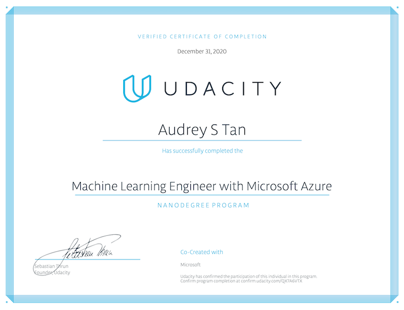
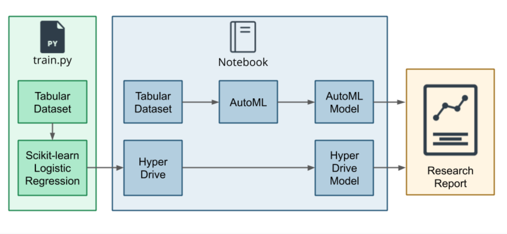
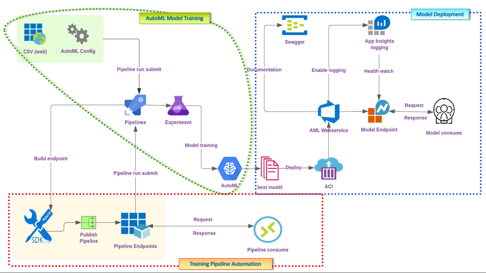

# Machine Learning Engineer with Microsoft Azure Nanodegree (MLEMAND), Udacity
I was one of the 300 MLEMAND recipients chosen from the 3,000 participants in the _**Machine Learning Scholarship Program for Microsoft Azure**_. This repo contains a collection of project deliverables from my MLEMAND course work. 
 ---

_*Project notebooks are stowed in secured storage to discourage improper access. For legitimate needs, please email to request access*_.

## Project Deliverables Summary
### 1. [Optimizing a Machine Learning Pipeline](https://github.com/atan4583/Azure-ML-Engineer-Nanodegree-Project-Portfolio/tree/master/Optimizing-an-AML-Pipeline)
> * Build and optimize an Azure ML model by training two models, one using Scikit-learn algorithm connected to `Azure HyperDrive` (a hyperparameter tuning engine), and the other, using `Azure AutoML` automated training process. The optimized or best performing model is chosen from the two approaches. The workflow is as shown below (**Image credit: Udacity MLEMA Nanodegree**):
>
> 
>
> * The Bank Marketing dataset from [UCI ML Repository](https://archive.ics.uci.edu/ml/datasets/Bank+Marketing) was used to train the two models.
>
>
> * Project specification: refer to this [rubric](https://github.com/atan4583/Azure-ML-Engineer-Nanodegree-Project-Portfolio/blob/master/project1-rubric.pdf) 
>
>
> * Project code and artifact repository: click [here](https://github.com/atan4583/Azure-ML-Engineer-Nanodegree-Project-Portfolio/tree/master/Optimizing-an-AML-Pipeline)
> 
>
> * Tool: Azure ML Studio, Azure Python SDK, Jupyter Notebook
>
>
> * Artifact: [udacity-project.ipynb](https://drive.google.com/file/d/1jLBo2XVO0qByslofNCIjN7Mhl0YiYEPt/view?usp=sharing), train.py, README.md
>
>
> 
 ---
### 2. [Operationalizing Machine Learning](https://github.com/atan4583/Azure-ML-Engineer-Nanodegree-Project-Portfolio/tree/master/Operationalizing-ML)
> * Use this [Bank Marketing dataset](https://automlsamplenotebookdata.blob.core.windows.net/automl-sample-notebook-data/bankmarketing_train.csv) to configure an Azure cloud-based machine learning production model, deploy it, and consume it. Also create, publish and consume a pipeline from the training experiment run. Finally, create a README file and a screencast video to demonstrate the working ML model. The workflow is as shown below:
>
> 
>
>
> * Project specification: refer to this [rubric](https://github.com/atan4583/Azure-ML-Engineer-Nanodegree-Project-Portfolio/blob/master/project2-rubric.pdf)
>
>
> * Project code and artifact repository: click [here](https://github.com/atan4583/Azure-ML-Engineer-Nanodegree-Project-Portfolio/tree/master/Operationalizing-ML)
> 
> 
> * Tool: Azure ML Studio, Azure Python SDK, Jupyter Notebook, [Apache Benchmarking tool](https://httpd.apache.org/docs/2.4/programs/ab.html), [Swagger](https://swagger.io/)
>
>
> * Artifact: [aml-pipelines-with-automated-machine-learning-step.ipynb](https://drive.google.com/file/d/1WJo_Njec6ba41H54E9c9iboUoOqCzQcW/view?usp=sharing), train.py, README.md, screencast of the working ML model
>
>
>
 ---
### 3. [AML Engineer Capstone Project - Loan Application Prediction](https://github.com/atan4583/Azure-ML-Engineer-Nanodegree-Project-Portfolio/tree/master/Capstone-Loan-App-Prediction)
> * Create two models: one using Automated ML (denoted as AutoML) and one customized model whose hyperparameters are tuned using HyperDrive. Compare the performance of both the models and deploy the best performing model as a web service. The workflow is as shown below:
> 
> 
>
> * Use a dataset external to the Azure ML ecosystem to train the models, e.g. from Kaggle, UCI ML repository, or any other open-source data repositories. The dataset format must be supported by Azure ML's `automl` API.
>
>
> * Project specification: refer to this [rubric](https://github.com/atan4583/Azure-ML-Engineer-Nanodegree-Project-Portfolio/blob/master/project3-rubric.pdf)
>
>
> * Project code and artifact repository: click [here](https://github.com/atan4583/Azure-ML-Engineer-Nanodegree-Project-Portfolio/tree/master/Capstone-Loan-App-Prediction)
> 
> 
> * Tool: Azure ML Studio, Azure Python SDK, Jupyter Notebook
>
>
> * Artifact: [automl.ipynb](https://drive.google.com/file/d/1O4BuxdhVPv9pzFBg9mSWYNf4428ThwOq/view?usp=sharing), [hyperparameter_tuning.ipynb](https://drive.google.com/file/d/131wp_zP7RuHuknl7JycV5uCMAaX3Do5z/view?usp=sharing), [train.py](https://drive.google.com/file/d/1durg9EltzRvWMrmMZ1rvbh2H08zzS5K2/view?usp=sharing), conda_env.yml, score.py, screencast of the working ML model 
>
>
> 
 ---
>
>
